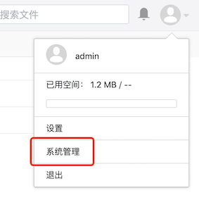

# Seafile 安装脚本

> 从 2024 年开始，一键安装脚本不再维护，请使用 Docker 来安装。

一键安装脚本可以帮助您在 Ubuntu 18.04/20.04 系统上快速的安装好 Seafile 服务器，并配置好 MariaDB, Memcached, WebDAV, Ngnix 和开机自动启动脚本。


## 使用步骤

安装干净的 Ubuntu 18.04/20.04，并**做好镜像** (如果安装失败需要还原到镜像)。

切换成 root 账号 (`sudo -i`)


### 获取安装脚本

适用于 Seafile 8.0.x 及以上版本

```sh
wget https://raw.githubusercontent.com/haiwen/seafile-server-installer-cn/master/seafile-8.0_ubuntu
```

### 运行安装脚本并指定要安装的版本 (例如 8.0.0)

```
bash seafile-8.0_ubuntu 8.0.0
```

脚本会让您选择要安装的版本, 按照提示进行选择即可:

* 如果要安装专业版, 需要先将下载好的专业版的包 `seafile-pro-server_8.0.0_x86-64.tar.gz` 放到 `/opt/` 目录下
* 如果是安装开源版，安装脚本在执行过程中会检查 `/opt`目录下是否有指定版本号的安装包，如果存在则会安装此包，否则会从 Seafile 网站下载。所以，为了避免因下载失败而导致安装中断，您可以提前下载好安装包放到`/opt/`目录下。

该脚本运行完后会在命令行中打印配置信息和管理员账号密码，请仔细阅读。(您也可以查看安装日志`/opt/seafile/aio_seafile-server.log`)，MySQL 的 root 用户密码存储在 `/root/.my.cnf` 中；MySQL 的 seafile 用户密码存储在 `/opt/seafile.my.cnf` 中。


### 通过 Web UI 对服务器进行配置

安装完成后，您需要通过 Web UI 服务器进行基本的配置，以便能正常的从网页端进行文件的上传和下载：

1. 首先在浏览器中输入服务器的地址，并用管理员账号和初始密码登录

2. 点击界面的右上角的头像按钮进入管理员界面
  

3. 进入设置页面填写正确的服务器对外的 SERVICE_URL 和 FILE_SERVER_ROOT，比如
    ```
    SERVICE_URL: http://www.example.com
    FILE_SERVER_ROOT: http://www.example.com/seafhttp
    ```

现在您可以退出管理员界面，并进行基本的测试。关于服务器的配置选项介绍和日常运维可以参考 https://cloud.seafile.com/published/seafile-manual-cn/config/README.md


### 如果安装脚本出错

如果安装脚本出错，您需要重置虚拟机到干净的镜像。


### 启动关闭服务

自动安装脚本会在系统中安装开机自动启动脚本。您也可以使用该脚本来关闭/启动 Seafile 服务，命令如下：

```
service seafile-server stop
service seafile-server start
```
